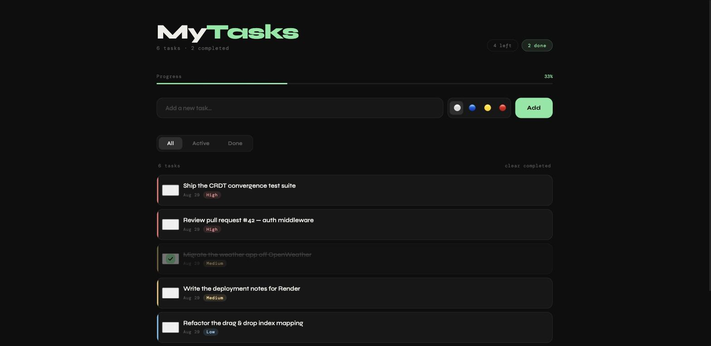

# MyTasks

Gestor de tareas en React con reordenamiento por arrastre, prioridades y
persistencia local. Sin backend: todo vive en `localStorage`.

**Demo:** https://task-tracker-santiago.vercel.app

   



<sub>Prioridades, barra de progreso y filtros; el orden se cambia arrastrando.</sub>


## Qué hace

- CRUD completo, con edición en línea (Enter confirma, Escape cancela)
- Prioridad alta / media / baja
- Reordenar arrastrando, usando la API nativa de HTML Drag & Drop
- Filtros Todas / Activas / Hechas y barra de progreso
- Todo se guarda al vuelo: cerrás el navegador y sigue donde lo dejaste

## Stack

React 18 · Vite · CSS a mano, sin framework de estilos

## Levantarlo

```bash
npm install
npm run dev      # desarrollo
npm run build    # producción, queda en dist/
```

## Notas de implementación

**Reordenar con un filtro puesto.** La lista que se ve puede estar filtrada,
así que la posición donde soltás no es la misma que la posición real dentro
del arreglo de tareas. Antes se usaba el índice visible tal cual y la tarea
aterrizaba en cualquier lado; ahora se traduce mirando el `id` del elemento
de destino.

**IDs.** `crypto.randomUUID()` en vez de `Math.random()`, que con ocho
caracteres podía repetir.
